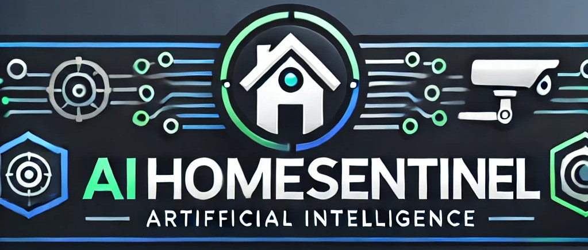

# AIHomeSentinel

**AIHomeSentinel** is an advanced AI-powered home security system designed for real-time monitoring and threat detection. Utilizing a Raspberry Pi and an infrared camera, it offers a comprehensive solution for home safety.
## Features
- **Person Detection**: Uses deep learning models to identify individuals entering your home.
- **Weapon Recognition**: Detects potential threats such as guns and knives.
- **Behavior Analysis**: Evaluates aggressive postures to differentiate between safe and dangerous situations.
- **Home Assistant Integration**: Seamlessly connects with Home Assistant for comprehensive automation and alerts.
- **Dynamic Camera Control**: Adjusts camera positioning based on detected movements and alarm status.
- **User Notifications**: Provides mobile alerts with live feeds when suspicious activities are detected.
## Getting Started
### Prerequisites
- Raspberry Pi 3 B+ or higher
- Infrared camera
- Home Assistant setup
- Python 3.x
- Required libraries (see `requirements.txt`)
### Installation
1. Clone the repository:
   ```bash
   git clone https://github.com/JenFa-Innovations/AIHomeSentinel.git
   cd AIHomeSentinel
   ```
2. Install the required packages:
   ```bash
   pip install -r requirements.txt
   ```
3. Configure your camera and Home Assistant settings as per the documentation in the relevant folders.
## Usage
To start the system, run the main script:
```bash
python AIHomeSentinel.py
```
### Training the AI Models
For training the AI models, follow the instructions in the respective model folders. Each folder contains its own `README.md` with detailed guidelines on preparing datasets and training processes.
## Contributing
Contributions are welcome! Please open an issue or submit a pull request for any enhancements or bug fixes.
## License
This project is licensed under the MIT License. See the LICENSE file for details.
## Acknowledgements
- [TensorFlow](https://www.tensorflow.org/) for machine learning frameworks
- [OpenCV](https://opencv.org/) for computer vision tasks
- [Home Assistant](https://www.home-assistant.io/) for home automation integration